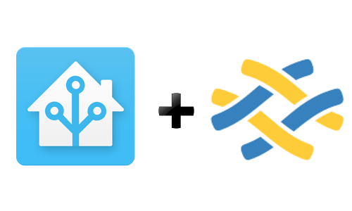

# fabric-home-assistant


 
 
  Easily deploy a complete Home-Assistant server, complete with Websocket MQTT and Z-Wave support out of the box using Fabric! 
 
 Start with a fresh Raspbian Jessie/Jessie-Lite or Debian 8 install, and the fabric script will do the following automatically:
*  Create all needed directories
*  Create needed service accounts
*  Install OS and Python dependencies
*  Setup a virtualenv to run Home-Assistant and components inside.
*  Run as a service account
*  Install Home-Assistant in a virtualenv
*  Build and install Mosquitto from source with websocket support
*  Build and Install Python-openzwave in the Home-Assistant virtualenv
*  Add both Home-Assistant and Mosquitto to systemd services to start at boot

<hr>

**What is [Fabric](http://www.fabfile.org)?**
 The official README says:
>  "Fabric is a Python (2.5-2.7) library and command-line tool for streamlining the use of SSH for application deployment or systems administration tasks."
 
<hr> 
 
###  Usage:
 **Setup:**
 
 Simply install fabric locally:
 ```pip3 install fabric3```
 
 Ensure you're able to SSH into the target server.
 
 
 Clone the repo : ``` git clone https://github.com/jbags81/fabric-home-assistant.git ``` on  your local host.
 The repo contains a pre-configured default mosquitto.conf file. The only addition is an added listener for websockets listening on 9001. It also contains preconfigured systemd service profiles. For the fabric script to run successfully, it has to be ran from the root of the cloned repo. 
 
 Edit ```fabfile.py``` and add the host info for the target host.
 

 **Deploy:** 

 
 Run the "deploy" job to build a new home-assistant server: ``` fab deploy ``` , then reboot. 
 Everything will start at boot, and Home-Assistant is accessible now from **http://your_server_ip:8123**
 
 The Home-Assistant configs are located in: ```/home/hass``` The virtualenv path, along with where all python packages will install is located at: ```/srv/hass/hass_venv```
   
<hr>
 Fabric allows any of the underlying functions to be ran individually as well. Run ``` fab -l ``` to see a list of all callable jobs. 
 
 Future support for non-virtualenv based servers will be added, along with the ability to auto upload existing or backup .yaml Home-Assistant configs. I'm also working on a turn-key devlopment script to make testing and development environments one click setups.. More to come!
 
 
 
 
**Tested with Raspbian Jessie, Jessie-Lite, and Debian 8 (username and path modifications needed)**
 
 
 
 
**Tested with Raspbian Jessie, Jessie-Lite, and Debian 8**
